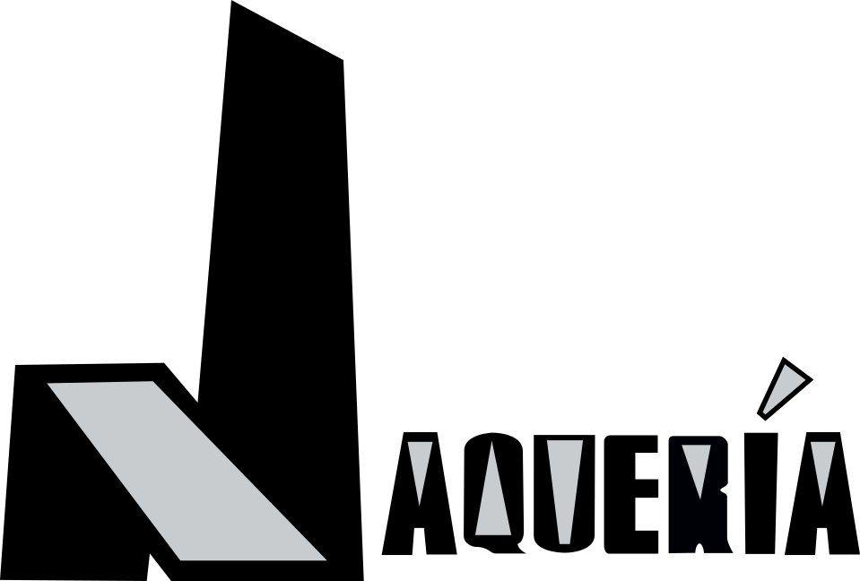

# Autor / autores

Autor: La Jaqueria

Bio:

Creemos en el conocimiento libre y en que las tecnologías son para todos, no solo para los ingenieros y técnicos. Con el arte y las humanidades, podemos usarla tanto para entender como funciona nuestro mundo así como mejorarlo. Además todos tenemos carencias que son facilmente suplidas si nos juntamos con más personas.

> "Si quieres ir rápido, camina solo. Si quieres llegar lejos, ve acompañado"
